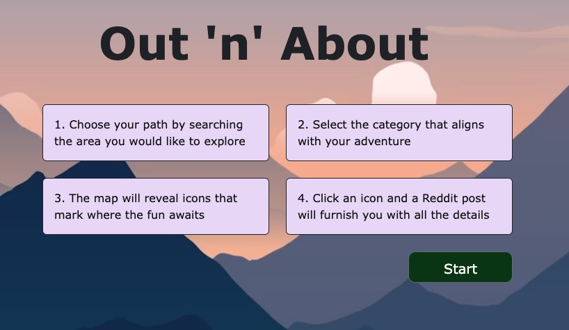

# stunning-guacamole

# Out N' About #

## Project Description: ##

This app will serve as an adventurer’s guide to discovering, exploring, and experiencing landmarks, outdoor activities, campsites, local events and attractions and music specific to your location and adventure theme. Users will be able to access google maps to “scope the scene”. 

## Features ##
    - Find local attractions, events, landmarks, outdoor activities, and campsites specific to your location nationwide.
    - Access Google Maps to "scope the scene".
    - Our app will provide you with a brief summary from a Reddit user, giving you the inside scoop on what makes it special.

## Technologies Used ##
    - HTML & CSS for the structure and styling
    - jQuery for dynamically updating HTML and CSS
    - bootstrap
    - javascript
    - server side API's; google maps, geocoder, googleplace.

## Installation ##

    Clone the repository:

    git clone https://github.com/jtpheonix13/stunning-guacamole.git

## How to Use ##
        
    - Upon opening the OutNAbout App, you will be prompted to enter your location. This will allow the app to search for attractions, events, and activities in your area.

    - Once you have entered your location, you can browse through the various categories of activities and attractions, such as Landmarks, Outdoor Activities, and Campsites. You can also browse by Adventure Themes, such as Adventure Sports, Nature Hiking, and Water Sports.

    - Click on any of the listings to view more information, including a description, reviews, and a map showing the location.
